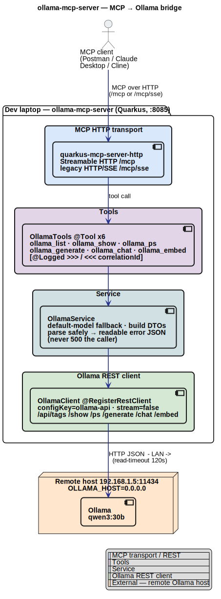
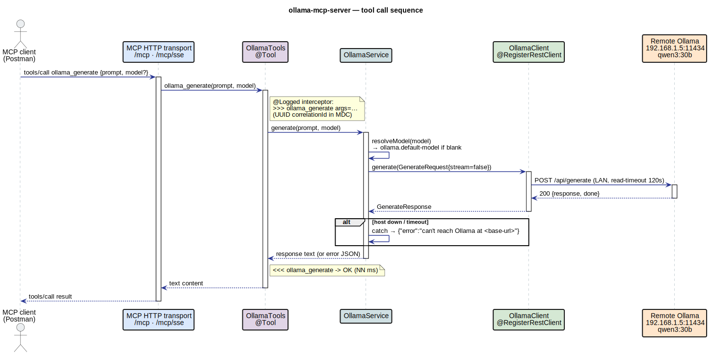

# ollama-mcp-server

[](https://github.com/ksktechai/ollama-mcp-server/actions/workflows/ci.yml)

A thin, well-documented **MCP → Ollama bridge** built on Quarkus. It exposes a small set of MCP
tools that forward to a **remote** Ollama instance's REST API, so any MCP client (Postman, Claude
Desktop, Cline, another Quarkus app) can drive models running on a separate machine. No database,
no streaming reassembly, no passthrough REST surface — one REST client and six tools you can read
in ten minutes.

- **Java:** OpenJDK 25 (`maven.compiler.release=25`)
- **Quarkus:** 3.33.2 (LTS), `io.quarkus.platform` BOM
- **MCP:** `io.quarkiverse.mcp:quarkus-mcp-server-http` 1.12.1 (HTTP transport, **not** stdio)
- **Group / Artifact:** `nz.co.ksktech` / `ollama-mcp-server`
- **Package root:** `nz.co.ksktech.ollamamcp`

> This server speaks **only the MCP protocol**. There are no debug/passthrough REST endpoints —
> clients consume it via their MCP connection feature (see [Connecting clients](#connecting-clients)).

---

## Architecture



*Editable source: [`docs/architecture.puml`](docs/architecture.puml) — re-render with
`plantuml -tsvg -o . docs/architecture.puml` (`brew install plantuml`).*

Colour key: **blue** = MCP transport / REST, **purple** = tools, **cyan** = service,
**green** = Ollama REST client, **orange** = external remote Ollama host.

The flow is deliberately linear:

- **`OllamaTools`** — one CDI bean with six `@Tool` methods (names mirror the well-known
  `rawveg/ollama-mcp` surface). Thin pass-throughs; `@ToolArg` descriptions are what clients show.
- **`OllamaService`** — default-model fallback, builds request DTOs, calls the client, and
  **parses safely / never 500s the caller**: any failure becomes a readable JSON error that names
  the base URL.
- **`OllamaClient`** — a `@RegisterRestClient(configKey = "ollama-api")` typed client. Every call
  sends `"stream": false` so responses are a single JSON object.
- **`InvocationLoggingInterceptor`** — `@Logged` on the tools logs every call with the
  `>>> / <<<` convention and a per-call `correlationId` (UUID in the MDC), bodies truncated to
  `app.logging.max-body`.

<details>
<summary><b>Tool-call sequence</b> — Postman → MCP transport → tools → service → client → remote Ollama</summary>



*Source: [`docs/sequence/tool-call.puml`](docs/sequence/tool-call.puml) — re-render with
`plantuml -tsvg -o rendered docs/sequence/tool-call.puml`.*
</details>

---

## Tools

| Tool | Arguments | Does |
| --- | --- | --- |
| `ollama_list` | — | List models on the remote host (`GET /api/tags`) → JSON array of names. Call this first. |
| `ollama_show` | `model?` | Model details (`POST /api/show`): license, parameters, template, info. |
| `ollama_ps` | — | Models currently loaded in memory (`GET /api/ps`). |
| `ollama_generate` | `prompt`, `model?` | One-shot completion (`POST /api/generate`). Returns the text. |
| `ollama_chat` | `messagesJson`, `model?` | Chat (`POST /api/chat`). `messagesJson` is a JSON array of `{role, content}`; malformed input returns a readable error, not a 500. |
| `ollama_embed` | `input`, `model?` | Embeddings (`POST /api/embed`). `input` is a string or JSON array of strings. Returns the vector(s). |
| `run_postman_collection` | `collectionPath?`, `analyze?`, `analysisModel?` | **Ops tool** (not Ollama): runs a Postman collection with Newman and returns a parsed pass/fail summary (iterations, requests, assertions, failures). Lets an MCP client trigger a collection run, which it otherwise can't do. With `analyze=true` it also adds a local-LLM `analysis` of the run. |

`model` is always optional — blank falls back to `ollama.default-model` (`qwen3:30b` by default).

### `run_postman_collection` — running collections from an MCP client

MCP clients (Postman Agent Mode, Claude Desktop, Cline) can drive an LLM but have no built-in
"run a Postman collection" capability. This tool fills that gap: it shells out to
[Newman](https://github.com/postmanlabs/newman) (no global install — `npx --yes newman` by
default) and returns a compact JSON summary instead of raw CLI output. It targets the API the
collection points at, so that API must be running.

- `collectionPath` (optional) — absolute path to a `.json` collection; blank uses
  `app.newman.collection`.
- `analyze` (optional, default false) — if true, the result also carries an `analysis` field: a
  short natural-language summary/triage from the local Ollama model. The run + analysis happen in a
  **single tool call**, so an MCP client (or agent) gets both at once.
- `analysisModel` (optional) — model used for the analysis (only when `analyze=true`); blank uses
  the default model. A smaller model (e.g. `qwen3:8b`) is faster.
- Config (override via env): `app.newman.collection`, `app.newman.command` (set to an absolute
  path if `npx` isn't on the server's PATH), `app.newman.request-timeout-ms`,
  `app.newman.run-timeout-seconds`, `app.newman.report-path`.

The deterministic result stays the source of truth; `analyze` is an advisory layer (the model is
fed a compact, ground-truth digest and told to use only that data) and adds a model call, so it's
slower. The bundled script's `ANALYZE=1` flag does the same thing client-side by chaining two
tools — use whichever fits: one tool call (this), or composable steps (the script).

**Where to see the result.** The tool's *return value* is the result — a JSON summary returned to
the MCP client (e.g. expand the tool call in Postman Agent Mode). It mirrors the Postman Runner
view: top-level `{passed, exitCode, durationMs, stats}` plus a `requests[]` array grouped like the
Runner (`folder`, `name`, `method`, `url`, `code`/`status`, `timeMs`, `sizeB`, and per-assertion
`result` = PASS/FAIL/SKIP). The agent renders this as a table — but note it is **text in the agent
panel, not Postman's native "Run results" GUI** (that view is only produced when Postman itself
runs the collection). The `>>> / <<<` access log only traces timing, not the body — but the server
also logs a one-line outcome:

```
run_postman_collection result: passed=true exitCode=0 stats={"assertions":{"total":35,"failed":0},...}
```

To keep the **full** Newman JSON report, set `app.newman.report-path` (e.g.
`NEWMAN_REPORT_PATH=target/newman/last-report.json`); it's overwritten each run and its path is
echoed back in the result as `reportPath`. Left blank, the report goes to a temp file and is
deleted after summarising.

The tool never throws — a missing collection, missing Newman, or a run timeout all come back as a
readable error payload. Note it runs a local process on the server's host; it's intended as a
dev/automation convenience.

**Triggering it without Postman AI.** Postman's Agent Mode spends AI credits because an LLM picks
the tool. You don't need that — the MCP server is plain JSON-RPC, so you can invoke the tool
manually with the bundled script (no AI credits):

```bash
scripts/run-collection-via-mcp.sh                       # default collection on http://localhost:8085
MCP_URL=http://localhost:8085/mcp scripts/run-collection-via-mcp.sh
scripts/run-collection-via-mcp.sh /path/to/other.postman_collection.json
```

It does the MCP handshake and `tools/call`, then prints a Runner-style breakdown.

Add `ANALYZE=1` to also get a natural-language summary/triage from the **local Ollama model** (it
chains the result into the `ollama_generate` tool on the same MCP session — still no Postman AI
credits):

```bash
ANALYZE=1 scripts/run-collection-via-mcp.sh                  # uses qwen3:8b (fast)
ANALYZE=1 ANALYZE_MODEL=qwen3:30b scripts/run-collection-via-mcp.sh
```

Best practice: the deterministic breakdown (counts + per-assertion PASS/FAIL) is the source of
truth — keep it. Treat the model output as advisory interpretation, most useful for triaging
*failures* and flagging slow endpoints, not for deciding pass/fail. The summary fed to the model is
a compact, ground-truth digest (not the raw report), and the prompt constrains it to the provided
data to limit hallucination.

(Equivalent paths:
add a `tools/call` request for `run_postman_collection` to
[`docs/postman/ollama-mcp-server-mcp.postman_collection.json`](docs/postman/ollama-mcp-server-mcp.postman_collection.json),
or invoke the tool directly from Postman's **MCP Request** panel — both avoid Agent Mode / AI
credits.)

---

## Prerequisites

- **JDK 25** (`java -version` → 25.x).
- A **reachable Ollama** at `http://192.168.1.5:11434` with `qwen3:30b` pulled
  (`ollama pull qwen3:30b` on that host).

### Remote Ollama (read this first)

Ollama runs on a **separate machine** so the dev laptop isn't overloaded. By default Ollama binds
to loopback only, which the LAN can't reach. On the **Ollama host**, bind it to all interfaces:

```bash
# macOS
launchctl setenv OLLAMA_HOST 0.0.0.0:11434
# then restart Ollama

# Linux (systemd): add  Environment="OLLAMA_HOST=0.0.0.0:11434"  to the service, then
# sudo systemctl restart ollama
```

Verify from **this** machine before starting the server:

```bash
curl http://192.168.1.5:11434/api/tags
```

If that fails, no tool will work — fix connectivity first.

---

## Run

```bash
cp .env.example .env          # adjust OLLAMA_BASE_URL / OLLAMA_DEFAULT_MODEL if needed
./mvnw quarkus:dev            # http://localhost:8085
```

> **Port:** this server listens on **8085** by default (not 8080), so it won't clash with other
> apps or Postman collections running on 8080. Override with `MCP_HTTP_PORT` (env / `.env`) or
> `./mvnw quarkus:dev -Dquarkus.http.port=9090`.

Quarkus auto-loads `.env` in dev. Everything is config-driven; nothing hard-codes the host:

```properties
ollama.base-url=${OLLAMA_BASE_URL:http://192.168.1.5:11434}
ollama.default-model=${OLLAMA_DEFAULT_MODEL:qwen3:30b}
ollama.timeout=${OLLAMA_TIMEOUT:120s}
quarkus.rest-client.ollama-api.url=${ollama.base-url}
quarkus.rest-client.ollama-api.read-timeout=120000
app.logging.max-body=2000
```

The MCP server exposes **both** transports (pick whichever your client expects):

| Transport | Endpoint |
| --- | --- |
| Streamable HTTP | `http://localhost:8085/mcp` |
| Legacy HTTP/SSE | `http://localhost:8085/mcp/sse` |

Health check: `http://localhost:8085/q/health`. (Replace `8085` with your `MCP_HTTP_PORT` if you
changed it.)

---

## Connecting clients

### Postman (the headline path)

Postman connects via **New → MCP Request** (a config-based connection), **not** a saved HTTP
collection.

1. `./mvnw quarkus:dev`.
2. **New → MCP Request**.
3. Transport: **HTTP** with URL `http://localhost:8085/mcp`, **or** **SSE** with URL
   `http://localhost:8085/mcp/sse`.
4. **Connect** → the six `ollama_*` tools appear.
5. Invoke **`ollama_list`** first (confirms the remote host is reachable), then **`ollama_generate`**.

> **Tools list empty?** Check the server is running and that
> `curl http://192.168.1.5:11434/api/tags` succeeds from this machine.

<!-- Screenshot placeholder: Postman MCP Request connected, six ollama_* tools listed.
     docs/mcp-clients/postman-connected.png -->

### Running automated tests from a Postman collection

The **MCP Request** panel above is interactive — it does not run `pm.test` assertions. To run
*automated* tests (Collection Runner / Newman), use the ready-made collection
[`docs/postman/ollama-mcp-server-mcp.postman_collection.json`](docs/postman/ollama-mcp-server-mcp.postman_collection.json).
It speaks MCP's JSON-RPC protocol directly over `/mcp` (Streamable HTTP): `initialize` →
`notifications/initialized` → `tools/list` → `tools/call`, asserting on each step.

1. **Import:** Postman → *Import* → select the JSON file.
2. **Check variables** (collection → *Variables*): `baseUrl` = `http://localhost:8085`,
   `model` = `qwen3:8b`. `sessionId` / `protocolVersion` fill in automatically.
3. **Run:** open the collection → *Run* (Collection Runner). Keep the requests **in order** —
   request 1 captures the `Mcp-Session-Id` every later request needs.

Headless / CI with [Newman](https://github.com/postmanlabs/newman):

```bash
npx newman run docs/postman/ollama-mcp-server-mcp.postman_collection.json --timeout-request 120000
# override the target, e.g. a different port:
# npx newman run ... --env-var baseUrl=http://localhost:9090 --env-var model=qwen3:30b
```

> This collection calls the **real** remote Ollama, so requests 4–5 need `192.168.1.5` reachable
> and the model pulled. (The offline, mocked tests are the JUnit suite — see [Tests](#tests).)

### Other clients

Copy-pasteable config snippets for each, all pointing at `/mcp` (Streamable HTTP) or `/mcp/sse`
(SSE):

- [Postman (MCP Request)](docs/mcp-clients/postman.md)
- [Claude Desktop](docs/mcp-clients/claude-desktop.md)
- [Cline (VS Code)](docs/mcp-clients/cline.md)
- [Quarkus MCP client](docs/mcp-clients/quarkus-mcp-client.md)

---

## Tests

```bash
./mvnw verify
```

Tests are **offline and deterministic** — they never call the real `192.168.1.5` host. The typed
`OllamaClient` is replaced with a Mockito mock in the `%test` profile.

- **`McpToolsListTest`** — connects an in-process MCP client (`McpAssured.newConnectedSseClient()`)
  and asserts all six tools are present with the expected names and argument schemas.
- **`OllamaToolCallTest`** — drives the tools end-to-end with the client mocked: `ollama_generate`
  returns the stubbed completion, `ollama_list` maps `/api/tags` into model names, malformed
  `ollama_chat` input returns the readable error payload (not a 500), and a simulated connection
  failure returns the `"can't reach <base-url>"` payload.

---

## Layout

```
src/main/java/nz/co/ksktech/ollamamcp/
  client/OllamaClient.java          @RegisterRestClient typed client (configKey=ollama-api)
  client/dto/OllamaDtos.java        request/response records (stream=false, ignoreUnknown)
  service/OllamaService.java        default-model fallback, safe parsing, readable errors
  tools/OllamaTools.java            six @Tool methods (the MCP surface)
  logging/Logged.java               interceptor binding
  logging/InvocationLoggingInterceptor.java   >>> / <<< + correlationId tracing
docs/architecture.puml|.svg         architecture diagram
docs/sequence/tool-call.puml        sequence diagram (rendered/ has the SVG)
docs/mcp-clients/                   Postman / Claude Desktop / Cline / Quarkus client snippets
```
